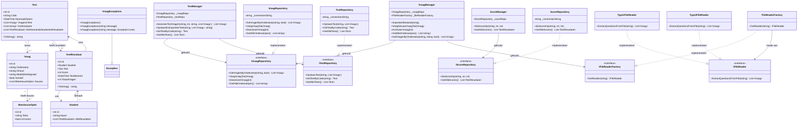

```mermaid
classDiagram

    %% ── Domeinmodellen ──────────────────────────────────────────────────────

    class Vraag {
        +int Id
        +string Onderwerp
        +string Inhoud
        +string Moeilijkheidsgraad
        +bool IsActief
        +List~MeerkeuzeOptie~ Keuzes
    }

    class MeerkeuzeOptie {
        +int Id
        +string Tekst
        +bool IsCorrect
    }

    class Test {
        +int Id
        +string Code
        +DateTime AanmaakDatum
        +List~Vraag~ VragenInTest
        +List~string~ Onderwerpen
        +List~TestResultaat~ DeelnemendeStudentenResultaten
        +ToString() string
    }

    class Student {
        +int Id
        +string Naam
        +List~TestResultaat~ AlleResultaten
    }

    class TestResultaat {
        +int Id
        +Student Student
        +Test Test
        +int Score
        +DateTime TestMoment
        +int TotaalVragen
        +ToString() string
    }

    class VraagExceptions {
        +VraagExceptions()
        +VraagExceptions(string message)
        +VraagExceptions(string message, Exception inner)
    }

    %% ── Relaties modellen ───────────────────────────────────────────────────

    Vraag "1" --> "0..*" MeerkeuzeOptie : heeft keuzes
    Test "1" --> "0..*" Vraag : bevat
    Test "1" --> "0..*" TestResultaat : heeft resultaten
    Student "1" --> "0..*" TestResultaat : behaalt
    TestResultaat --> Student : van
    TestResultaat --> Test : voor
    VraagExceptions --|> Exception

    %% ── Interfaces ──────────────────────────────────────────────────────────

    class IVraagRepository {
        <<interface>>
        +GetVragenByOnderwerp(string, bool) List~Vraag~
        +VoegVraagToe(Vraag)
        +DeactiveerVraag(int)
        +GetAlleOnderwerpen() List~string~
    }

    class ITestRepository {
        <<interface>>
        +OpslaanTest(string, List~Vraag~)
        +GetTestByCode(string) Test
        +GetAlleTests() List~Test~
    }

    class IScoreRepository {
        <<interface>>
        +SlaScoreOp(string, int, int)
        +GetAlleScores() List~TestResultaat~
    }

    class IFileReader {
        <<interface>>
        +ExtractQuestionsFromFile(string) List~Vraag~
    }

    class IFileReaderFactory {
        <<interface>>
        +GetReader(string) IFileReader
    }

    %% ── Managers ────────────────────────────────────────────────────────────

    class VraagManager {
        -IVraagRepository _vraagRepo
        -IFileReaderFactory _fileReaderFactory
        +ImporteerBestand(string)
        +VoegNieuweVraagToe(Vraag)
        +ArchiveerVraag(int)
        +GetAlleOnderwerpen() List~string~
        +GetVragenByOnderwerp(string, string, bool) List~Vraag~
    }

    class TestManager {
        -IVraagRepository _vraagRepo
        -ITestRepository _testRepo
        +GenereerTestVragen(string, int, string, List~Vraag~) List~Vraag~
        +OpslaanEnExporteerTest(string, List~Vraag~, string)
        +GetTestByCode(string) Test
        +GetAlleTests() List~Test~
    }

    class ScoreManager {
        -IScoreRepository _scoreRepo
        +SlaScoreOp(string, int, int)
        +GetAlleScores() List~TestResultaat~
    }

    %% ── Relaties managers ↔ interfaces ──────────────────────────────────────

    VraagManager --> IVraagRepository : gebruikt
    VraagManager --> IFileReaderFactory : gebruikt
    TestManager --> IVraagRepository : gebruikt
    TestManager --> ITestRepository : gebruikt
    ScoreManager --> IScoreRepository : gebruikt

    %% ── Repositories ────────────────────────────────────────────────────────

    class VraagRepository {
        -string _connectionString
        +GetVragenByOnderwerp(string, bool) List~Vraag~
        +VoegVraagToe(Vraag)
        +DeactiveerVraag(int)
        +GetAlleOnderwerpen() List~string~
    }

    class TestRepository {
        -string _connectionString
        +OpslaanTest(string, List~Vraag~)
        +GetTestByCode(string) Test
        +GetAlleTests() List~Test~
    }

    class ScoreRepository {
        -string _connectionString
        +SlaScoreOp(string, int, int)
        +GetAlleScores() List~TestResultaat~
    }

    class FileReaderFactory {
        +GetReader(string) IFileReader
    }

    class Type1FileReader {
        +ExtractQuestionsFromFile(string) List~Vraag~
    }

    class Type2FileReader {
        +ExtractQuestionsFromFile(string) List~Vraag~
    }

    %% ── Relaties repositories ↔ interfaces ──────────────────────────────────

    VraagRepository ..|> IVraagRepository : implementeert
    TestRepository ..|> ITestRepository : implementeert
    ScoreRepository ..|> IScoreRepository : implementeert
    FileReaderFactory ..|> IFileReaderFactory : implementeert
    Type1FileReader ..|> IFileReader : implementeert
    Type2FileReader ..|> IFileReader : implementeert
    FileReaderFactory --> IFileReader : maakt aan
```
